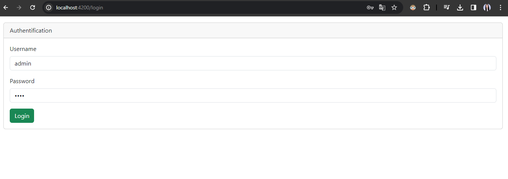
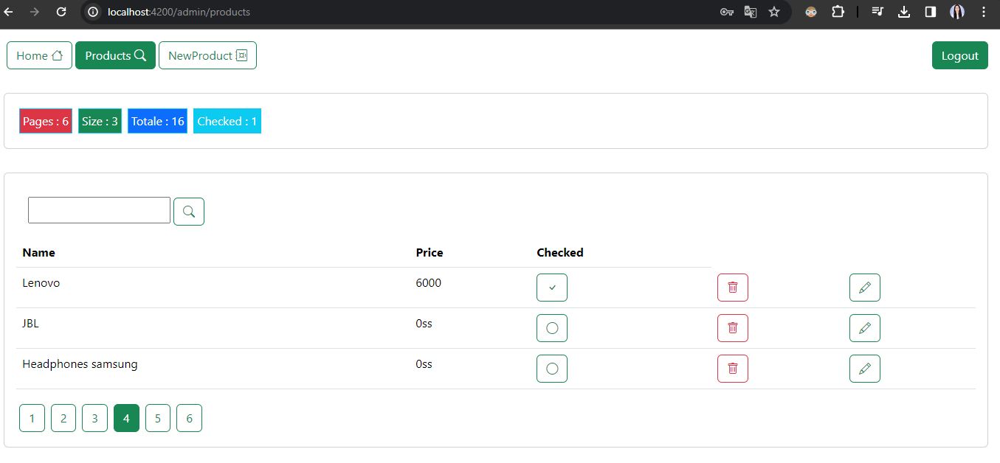
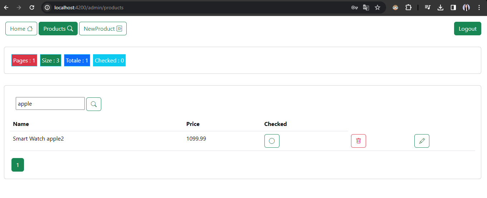
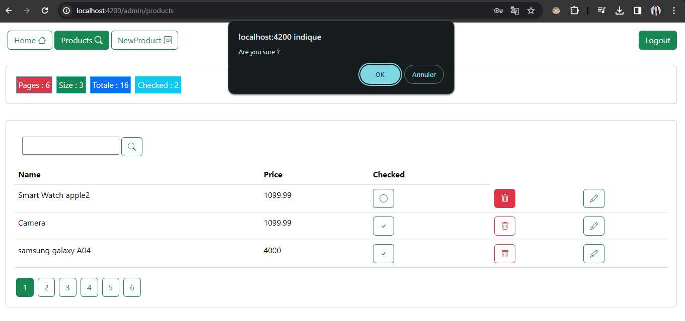
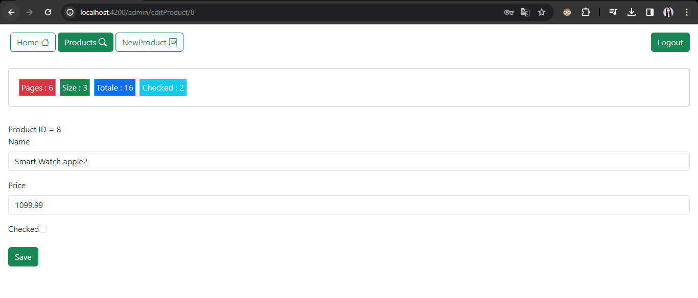
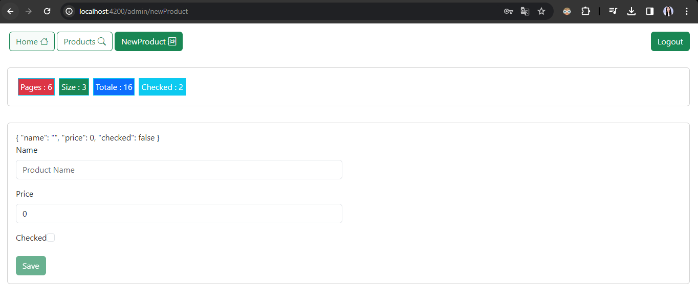

# Objectif :
Créer une application web basée sur Angular qui permet de gérer les produits. Chaque Produit est défini par son id, name, price, quantity, available. Le backend de l'application est basé sur une REST API basée sur Json-Server
L'application doit permettre de :

- Faire l'authentification et protéger les routes
  

- Afficher les produits et Faire la pagination:
  

- Chercher les produits:
  

- Supprimer un produit:
  

- Editer un produit
  

- Ajouter un nouveau produit
  

